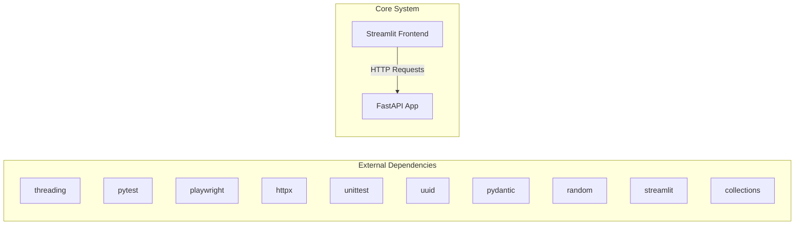

# Repository Architecture

*Auto-generated by CI/CD Pipeline*

## System Architecture

```mermaid
graph LR
    subgraph External Dependencies
        E0["threading"]
        E1["pytest"]
        E2["playwright"]
        E3["httpx"]
        E4["unittest"]
        E5["uuid"]
        E6["pydantic"]
        E7["random"]
        E8["streamlit"]
        E9["collections"]
    end
    subgraph Core System
        API["FastAPI App"]
        UI["Streamlit Frontend"]
    end
    UI -->|HTTP Requests| API
```

## Internal Dependency Graph

```mermaid
graph TD
    F0["streamlit_app.py"]
    click F0 "streamlit_app.py" "Go to source"
    F1["app.py"]
    click F1 "app.py" "Go to source"
    F2["validate.py"]
    click F2 "validate.py" "Go to source"
    F3["inference.py"]
    click F3 "inference.py" "Go to source"
    F4["frontend_test.py"]
    click F4 "frontend_test.py" "Go to source"
    F5["app.py"]
    click F5 "server/app.py" "Go to source"
    F6["__init__.py"]
    click F6 "server/__init__.py" "Go to source"
    F7["environment.py"]
    click F7 "env/environment.py" "Go to source"
    F8["corpus.py"]
    click F8 "env/corpus.py" "Go to source"
    F9["__init__.py"]
    click F9 "env/__init__.py" "Go to source"
    F10["llm_runtime.py"]
    click F10 "env/llm_runtime.py" "Go to source"
    F11["retriever.py"]
    click F11 "env/retriever.py" "Go to source"
    F12["graders.py"]
    click F12 "env/graders.py" "Go to source"
    F13["models.py"]
    click F13 "env/models.py" "Go to source"
    F14["prompt_optimizer.py"]
    click F14 "env/prompt_optimizer.py" "Go to source"
    F15["tasks.py"]
    click F15 "env/tasks.py" "Go to source"
    F16["llm_services.py"]
    click F16 "env/llm_services.py" "Go to source"
    F17["context_tuner.py"]
    click F17 "env/context_tuner.py" "Go to source"
    F18["test_environment.py"]
    click F18 "tests/test_environment.py" "Go to source"
    F19["test_environment_extra.py"]
    click F19 "tests/test_environment_extra.py" "Go to source"
    F20["test_streamlit_app.py"]
    click F20 "tests/test_streamlit_app.py" "Go to source"
    F21["test_inference.py"]
    click F21 "tests/test_inference.py" "Go to source"
    F22["test_api.py"]
    click F22 "tests/test_api.py" "Go to source"
    F23["test_llm_features.py"]
    click F23 "tests/test_llm_features.py" "Go to source"
    F24["test_server_app.py"]
    click F24 "tests/test_server_app.py" "Go to source"
    F25["test_inference_proxy.py"]
    click F25 "tests/test_inference_proxy.py" "Go to source"
    F26["test_fallback_logic.py"]
    click F26 "tests/test_fallback_logic.py" "Go to source"
    F27["test_prompt_optimizer.py"]
    click F27 "tests/test_prompt_optimizer.py" "Go to source"
    F1 -->|imports| F7
    F2 -->|imports| F10
    F3 -->|imports| F0
    F3 -->|imports| F7
    F5 -->|imports| F0
    F7 -->|imports| F0
    F10 -->|imports| F0
    F11 -->|imports| F0
    F11 -->|imports| F7
    F12 -->|imports| F7
    F12 -->|imports| F0
    F14 -->|imports| F0
    F14 -->|imports| F7
    F16 -->|imports| F7
    F17 -->|imports| F0
    F17 -->|imports| F7
    F18 -->|imports| F7
    F19 -->|imports| F7
    F20 -->|imports| F0
    F21 -->|imports| F3
    F22 -->|imports| F0
    F23 -->|imports| F0
    F24 -->|imports| F5
    F25 -->|imports| F10
    F26 -->|imports| F0
    F27 -->|imports| F7
```
